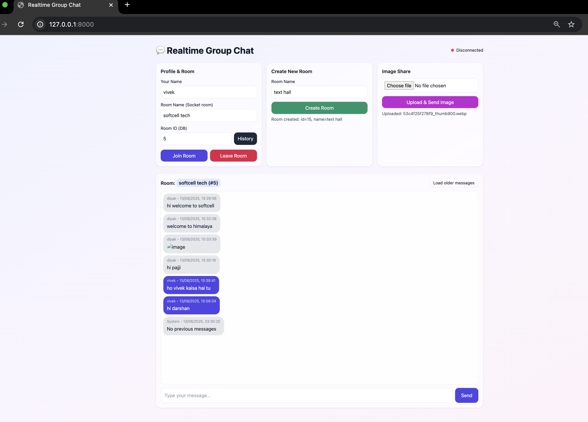
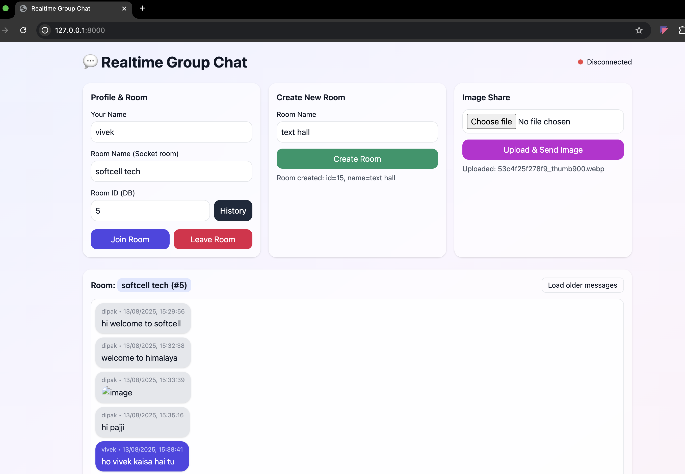

# Group_chat
A simple real-time group chat application built with FastAPI, Socket.IO, and PostgreSQL.

---

## 🚀 About the Project
A simple real-time group chat app built with:
- **Python (FastAPI + Socket.IO)** for backend
- **PostgreSQL** for message storage
- **HTML, CSS, JS** for frontend
- Supports **group chat, image sharing, and notifications**

---

## 🛠 Features
- Create and join chat rooms
- Send and receive messages in real-time
- Share images with preview
- Store messages in PostgreSQL with timestamp
- View chat history (with pagination)

---

## 📦 Tech Stack
- **Backend:** FastAPI, python-socketio
- **Database:** PostgreSQL
- **Frontend:** HTML, CSS, JavaScript
- **WebSocket Communication:** socket.io

---
## Screenshot1



### Chat Page 2



## ⚙️ Setup (Local Development)
### 1️⃣ Clone the repo
```bash
    - git clone https://github.com/yourusername/group_chat.git
    - cd group_chat

2️⃣ Create virtual environment

    - python -m venv venv
    - source venv/bin/activate   # Mac/Linux
    - venv\Scripts\activate      # Windows

3️⃣ Install dependencies

    - pip install -r requirements.txt

4️⃣ Configure database

    - Install PostgreSQL and create a database:
    - CREATE DATABASE chat_app;
    - Update your DB credentials in main.py or .env

5️⃣ Run the app

    - uvicorn main:fastapi_app --reload
